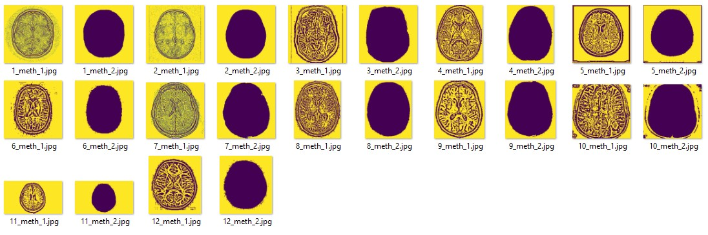
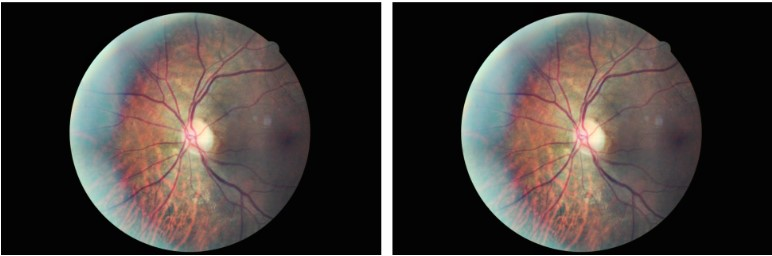

# Segmentation d'images médicales

 L'imagerie médicale joue un rôle central dans le domaine de 
la médecine en fournissant une vision précieuse des structures 
internes du corps. Des techniques telles que l'IRM, la TDM et la 
radiographie ont radicalement transformé la façon dont les 
professionnels de la santé perçoivent, diagnostiquent et traitent les 
pathologies. Cependant, la qualité et l'intégrité de ces images 
sont cruciales. Tout compromis sur la qualité peut entraîner une 
perte de détails fins ou l'introduction d'artefacts trompeurs, 
pouvant conduire à des interprétations erronées ..

Dans ce dépôt, vous trouverez deux dossiers contenant chacun une analyse de segmentation sur des ensembles de données différents.

